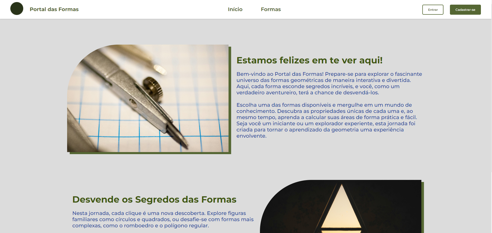

# Portal das Formas

O Portal das Formas é um exercício, proposto pelo professor Gabriel Azevedo, do curso PROPROFISSÃO. Nele você explorar um site web que há a funcionalidade de calcular a área de algumas formas geométricas.

Para acessar o deploy do projeto, basta clicar <a href="#">aqui</a>
